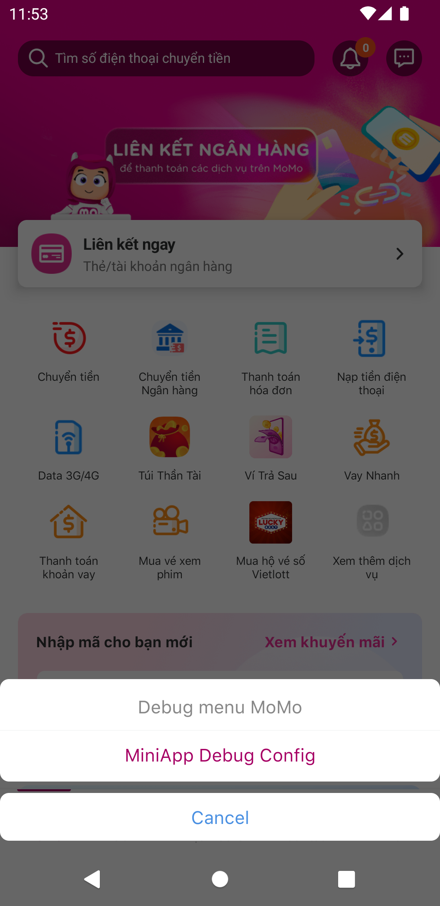
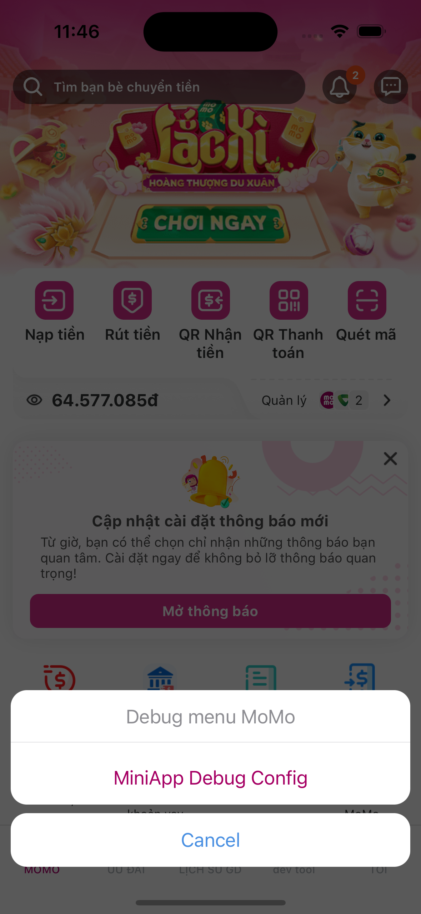
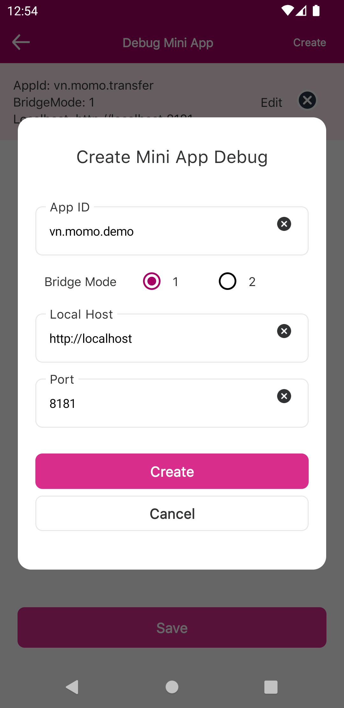
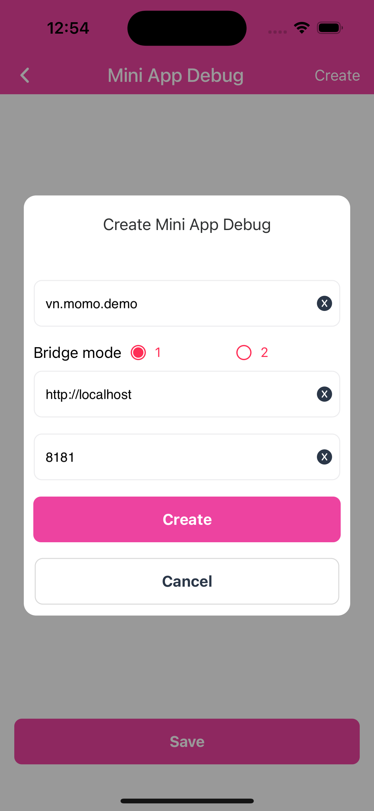
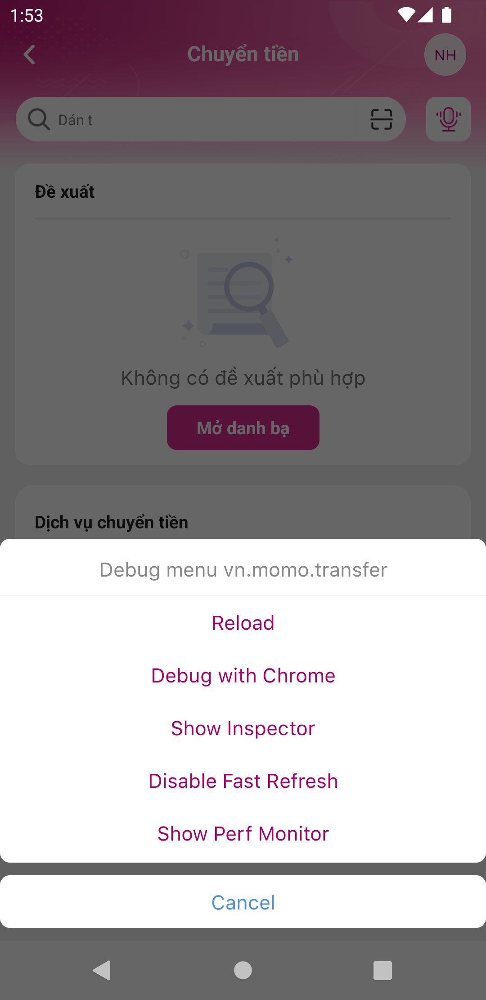
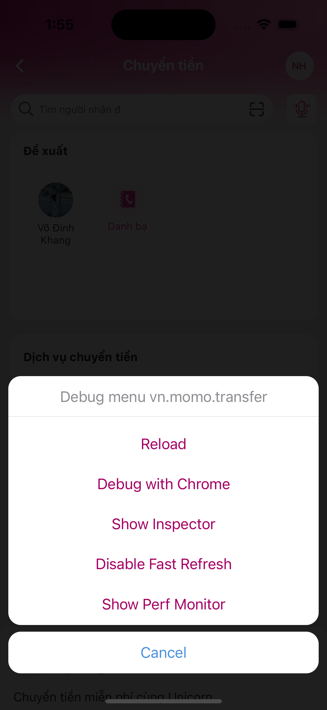
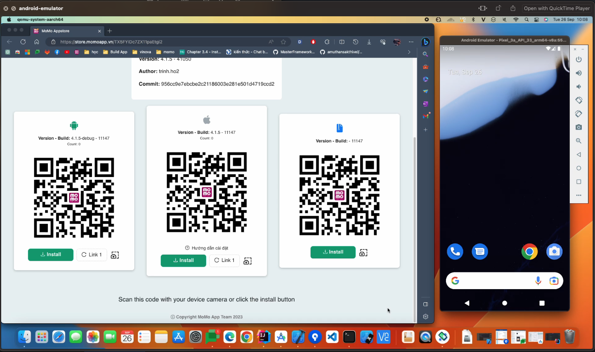
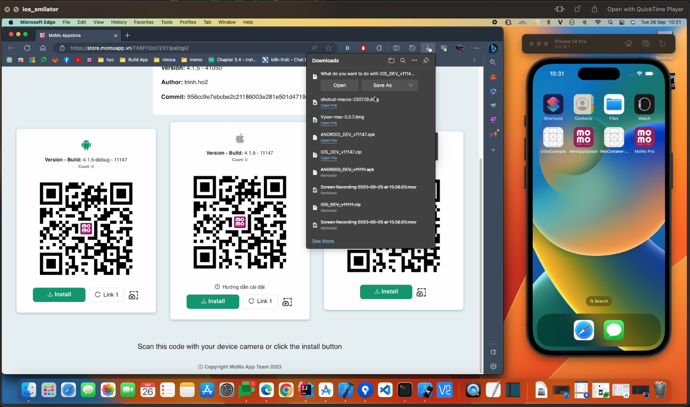

# Debug miniapp tutorial
- [Build engine gitlab ci](#build-engine-gitlab-ci)
- [Debug miniapp](#debug-miniapp)
- [Demo](#demo)

## Build engine gitlab ci 🚀️

Nếu bạn có quyền truy cập gitlab source momo-platfrom. Bạn có thể tự build engine nhánh mình muốn.

truy cập link: [momo-platform](https://gitlab.mservice.com.vn/momo-platform/momo-app)

vào tab `CI/CD -> Run pipeLine`

- Ở `Run for branch name or tag` chọn nhánh muốn build engine
- Ở `Input variable key` truyền `CI_COMMIT_MESSAGE`
- Ở `Input variable value` truyền `[ci engine]`
- nhấn Button `Run piplines`

## Debug miniapp 🎉️

#### **1. Cài đặt app**

- Sau khi có link của app Momo bản engine, mọi người tải về tuỳ theo môi trường muốn debug (android/ios/ios-simelator)
- Cài đặt app vào device để bắt đầu debug:
  - Android emulator: chọn vào file build`.apk` kéo thả vào emualtor.
  - Ios simulator: khi tải file build`.zip` về -> giải nén và lấy file được giải nèn kéo thả vào simulator.
 
#### **2. Debug**

##### 2.1 Mở Dialog view của debug miniapp:
  - Android/Ios real devices: lắc device để mở.
  - Android emulator: mở terminal tab nhập lệnh `adb shell input keyevent 82` hoặc `adb shell input keyevent KEYCODE_MENU`
  - Ios simulator: chọn vào simulator ở top tab navigation chọn `Device` -> `Shake`

| Android                                    | Ios                                    |
|--------------------------------------------|----------------------------------------|
|  |  |

##### 2.2 Thêm Miniapp vào list debug:
  - Ở tab  `Debug Menu` chọn `MiniApp Debug Config`
  - Nhấn Button `create` để tạo config miniapp:
    - `App ID` truyền miniapp app id
    - `Bridge Mode` truyền mode `1` hoặc `2`
    - `Local Host` truyền đường dẫn địa chỉ IP của máy tính deug (nếu device trùng địa chỉ IP với máy tính có thể dùng text `localhost`),
      - Lấy địa chỉ IP trong mac: mở `settings` -> `Network` -> `Wifi/Ethernet` -> `IP Address`
    - `Port` truyền port muốn debug miniapp (mặc định miniapp là 8181)
    - Nhấn `create` để tạo 
    - Nhấn `Save` để lưu vào debug list (sau đó app sẽ reload lại)

| Android                                               | Ios                                               |
|-------------------------------------------------------|---------------------------------------------------|
|  |  |

##### 2.3 Start environment miniapp:
  - Mở terminal trong source mini-app
  - Nếu chạy debug android mọi người chạy lệnh `adb reverse tcp:Port tcp:Port` (Port là số của miniapp đã config)
  - Nhập lệnh `yarn start` (bridge mode 1) hoặc `yarn start:metro` (bridge mode 2) để chạy môi trường debug
  - Trên device mở app momo tìm đến miniapp đã thêm vào mini debug list 
  - để mở tab menu debug làm lại như bước [2.1](#####-2.1-Mở-Dialog-view-của-debug-miniapp:)

| Android                                            | Ios                                            |
|----------------------------------------------------|------------------------------------------------|
|  |  |

## Demo

| Android                                                                                                                            | Ios                                                                                                                            |
|------------------------------------------------------------------------------------------------------------------------------------|--------------------------------------------------------------------------------------------------------------------------------|
|  |  |

